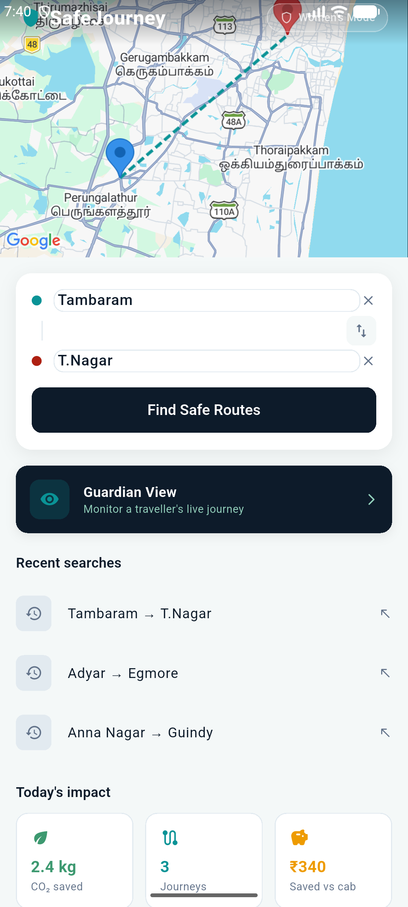
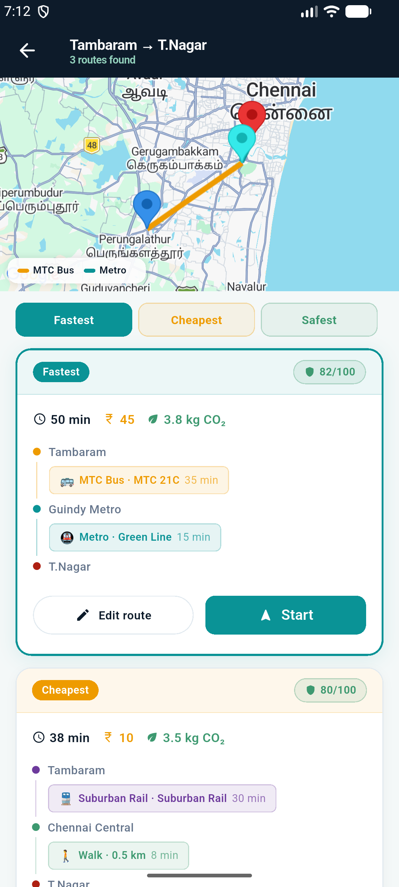
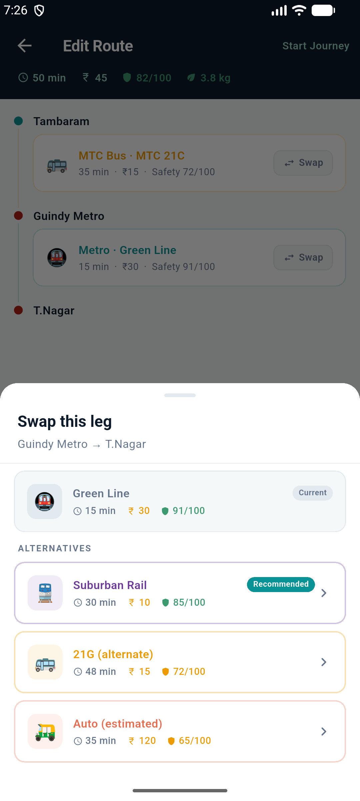
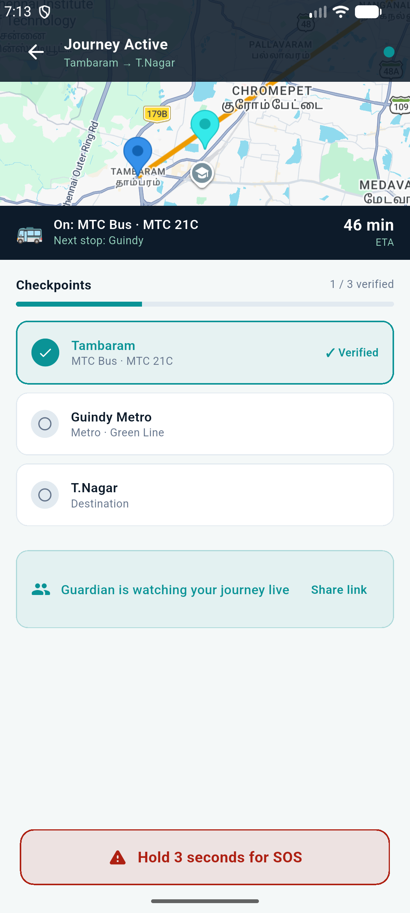
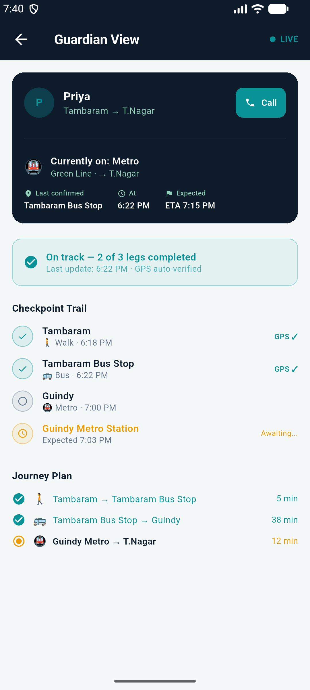
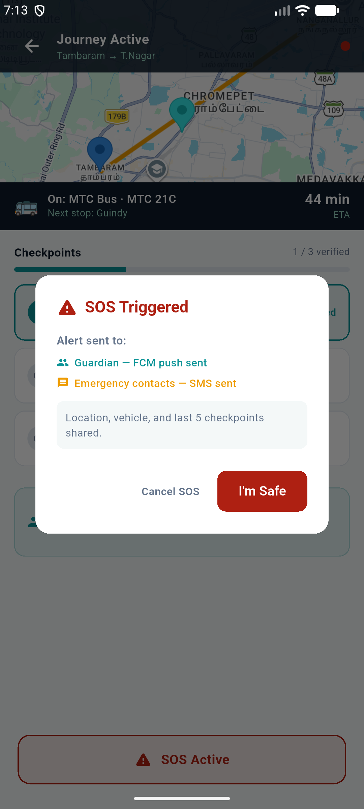

<div align="center">

<br/>

# 🛡️ SafeJourney

### Journey Assurance Platform

**Smarter Routes. Verified Safety. Journey Assurance.**

[](https://flutter.dev)
[](https://firebase.google.com)
[](https://developers.google.com/maps)

*OneJourney Mobility Hackathon 2026 · Track 1 + Track 2 + Track 3 · SRMIST, Kattankulathur*

</div>

---

## The Problem

Google Maps ends when you board the vehicle. **SafeJourney starts.**

Existing transit apps plan routes — but none verify that each leg was completed safely. Families see a moving dot, not a story. Women travelling alone have no discreet, always-on safety layer built into the journey itself.

> *"Parents don't care about a moving dot on a map. They want to know their daughter safely completed each part of the journey."*
>
> **That is Journey Assurance. That is SafeJourney.**

---

## Screenshots


| Home Screen | Route Results | Journey Editor |
|---|---|---|
|  |  |  |

| Active Journey | Guardian View | SOS |
|---|---|---|
|  |  |  |


---

## Hackathon Tracks

| Track | How SafeJourney addresses it |
|---|---|
| **Track 1** — Smart Multi-Modal Journey Planner | Metro + MTC Bus + Suburban Rail + Auto + Walk combined into single ranked plans |
| **Track 2** — Women Safety & Secure Commute | Safety-scored routes, GPS checkpoint tracking, live guardian view, 3-second SOS |
| **Track 3** — Carbon Reduction & Green Mobility | CO₂ saved per trip shown on every route card and at journey completion |

---

## What's Built — Current State

### Screens

**Splash Screen**
Animated fade + slide-in with SafeJourney logo. Navigates to Login after 2 seconds.

**Login Screen**
Phone number input UI. Runs in demo mode — Continue skips auth and goes straight to Home. Firebase Auth phone OTP is wired in code but not yet activated.

**Home Screen**
- Live Google Maps widget showing Chennai, with blue (origin) and red (destination) markers
- Markers and dashed teal polyline update in real time as user types or picks from autocomplete
- From/To search fields with Google Places Autocomplete — debounced 350ms, dropdown appears below card
- Women's Mode toggle with animated pill — shows info banner when active
- Swap button reverses origin and destination, updates map instantly
- Recent searches row (3 entries, tappable to fill fields)
- Today's impact cards showing CO₂ saved, journey count, savings vs cab (static display)

**Route Results Screen**
- Google Maps at top showing the selected route with polylines coloured per mode (teal = metro, amber = bus, purple = rail, green = walk, orange = auto)
- Walking legs shown dashed, transit legs solid
- Origin, destination, and transfer point markers
- Route legend overlay in map corner
- Tab selector — tapping Fastest / Cheapest / Safest switches map to that route
- Three RouteCards with: time, fare, CO₂, safety score badge (green/amber/red), full leg-by-leg breakdown
- Edit route and Start buttons per card

**Journey Editor Screen**
- Summary bar showing live totals: time, fare, safety score, CO₂ — updates immediately on swap
- Leg list with coloured connector lines per mode
- Swap button on each non-walking leg opens bottom sheet
- SwapPanel shows current leg + alternatives with mode, time, fare, safety score
- Alternatives with safety ≥ 80 get a "Recommended" badge
- Selecting an alternative: `swapLeg(index, newLeg)` — O(1), totals recalculate instantly
- Snackbar confirms the swap

**Active Journey Screen**
- Google Maps (260px) showing the full route with coloured polylines
- Cyan moving marker simulates current position along the route, camera follows
- Current leg banner: mode emoji, route label, next stop name, live ETA countdown
- Checkpoint list with verified (teal ✓) and unverified states, tap to verify manually
- Progress bar: X of Y checkpoints verified
- Guardian watching card with Share link button
- SOS button: hold 3 seconds, vibration countdown with progress bar, triggers confirmation dialog
- SOS dialog shows recipients (guardian FCM, emergency contacts SMS), Cancel and I'm Safe buttons

**Guardian Screen**
- Traveller card: name, route, current mode + vehicle label, destination
- Last confirmed stop, time, ETA
- Pulsing LIVE indicator
- On-track status banner (X of Y legs completed)
- Checkpoint trail with verified (GPS ✓) and pending (Awaiting...) states
- Journey plan leg list: done / current / upcoming
- One-tap Call button
- Currently uses demo data — Firebase stream connection is next phase

---

### Core Services

**RoutingService**
Calls Google Maps Directions API (`mode=transit`, `alternatives=true`). Parses real transit steps including per-leg encoded polyline points. Maps Google vehicle types → our modes. Extracts real stop names from `departure_stop`/`arrival_stop`. Estimates Chennai fares (Metro ₹10–60, Rail ₹5–30, Bus ₹5–20). Falls back to demo routes on any failure.

**PlacesService**
Google Places Autocomplete biased to Chennai (50km radius). Returns main text, secondary text, placeId. Falls back to static list of 20+ Chennai areas.

**SafetyScoreService**
24 pre-seeded Chennai zones across South / Central / North / West / OMR. Score = Crime (40%) + Lighting (20%) + Crowding (20%) + Community (20%). Time-of-day band adjustment (day / evening / night). Women's Mode threshold: 70/100. Decision-support metric — not a safety guarantee.

**GeofenceService**
Haversine distance formula for GPS checkpoint detection. 150m radius per stop. Adaptive polling: 15s near stop, 2min in transit. Missed checkpoint timer: expected duration + 8 min buffer. `resolveStopLocations()` matches plan stops against `assets/data/chennai_stops.json`. Fully written — not yet connected to ActiveJourneyScreen.

**FirebaseService**
All DB methods written: `saveJourney`, `watchJourney`, `addCheckpoint`, `updateLastLocation`, `triggerSOS`, `saveUserProfile`, `watchUserProfile`. SOS trigger writes full data packet (GPS, mode, route, checkpoint trail) to Firebase. Firebase initialised in `main.dart` — `initializeApp()` commented out pending `google-services.json`.

---

### Data Models

**Leg** — mode, startStop, endStop, durationMinutes, fare, safetyScore, routeLabel, polylinePoints. Computed: `co2SavedKg`, `modeEmoji`, `modeLabel`. Full JSON serialisation.

**JourneyPlan** — legs, checkpoints, origin, destination, userId, guardianUid, status. Computed: `totalMinutes`, `totalFare`, `avgSafetyScore`, `totalCo2Saved`. Core: `swapLeg(index, newLeg)` — O(1) immutable swap.

**Checkpoint** — stopName, time, verified, mode. Full JSON serialisation.

---

### Demo Routes

Three pre-built route sets for offline/fallback: Tambaram → T.Nagar, Adyar → Egmore, Anna Nagar → Guindy. Each with Fastest / Cheapest / Safest variants. All use real Chennai stop names and real GPS coordinates.

---

## Tech Stack

| Layer | Technology |
|---|---|
| Frontend | Flutter 3.x — Android |
| State | flutter_riverpod 2.5 |
| Navigation | go_router 14 |
| Maps | google_maps_flutter 2.7 |
| Location | geolocator 12 |
| Routing | Google Maps Directions API |
| Autocomplete | Google Places API |
| Backend | Firebase Realtime Database |
| Push (ready) | Firebase Cloud Messaging |
| SMS (ready) | Twilio (Cloud Function written) |
| Auth (UI ready) | Firebase Auth — Phone OTP |
| HTTP | http 1.2 |

---

## Project Structure

```
lib/
├── main.dart                               # Entry — Firebase.initializeApp() commented out
├── app/router.dart                         # 7 routes: /, /login, /home, /results, /editor, /journey, /guardian/:id
│
├── core/
│   ├── models/
│   │   ├── leg.dart                        # Mode, stops, fare, safety, CO2, polyline, serialisation
│   │   ├── journey_plan.dart               # Plan + Checkpoint + swapLeg() + computed totals
│   │   └── stop_locations.dart             # StopLocation data class (lat/lng)
│   ├── services/
│   │   ├── routing_service.dart            # Directions API + polyline decoder + fallback
│   │   ├── places_service.dart             # Places Autocomplete + static fallback
│   │   ├── safety_score_service.dart       # 24-zone score engine
│   │   └── firebase_service.dart           # All DB operations (written, not yet activated)
│   ├── data/
│   │   └── demo_routes.dart                # 9 hardcoded plans across 3 route pairs
│   └── theme/
│       └── app_theme.dart                  # Navy/teal/amber, full MaterialTheme 3
│
├── features/
│   ├── auth/
│   │   ├── screens/splash_screen.dart
│   │   └── screens/login_screen.dart       # Demo mode — skips auth
│   ├── journey_planner/
│   │   ├── screens/home_screen.dart        # Map + autocomplete + Women's Mode
│   │   ├── screens/route_results_screen.dart  # Map with coloured polylines + route cards
│   │   └── widgets/route_card.dart
│   ├── journey_editor/
│   │   ├── screens/editor_screen.dart      # Leg editor with live recalculation
│   │   └── widgets/swap_panel.dart         # Bottom sheet swap alternatives
│   ├── checkpoint/
│   │   └── screens/active_journey_screen.dart  # Map + checkpoints + SOS button
│   └── guardian/
│       └── screens/guardian_screen.dart    # Trail view — demo data, Firebase stream pending
│
└── services/
    └── geofence_service.dart               # GPS geofencing (written, not wired to journey screen)

assets/
├── data/
│   └── chennai_stops.json                  # Real GTFS GPS coordinates for Chennai stops
├── gtfs/                                   # Folder ready for MTC/CMRL feed data
└── images/screenshots/                     # Add screenshots here
```

---

## Setup

```bash
git clone https://github.com/YOUR_USERNAME/safe-journey.git
cd safe_journey
flutter pub get
flutter run
```

Runs immediately in demo mode — no API key or Firebase needed.

**To enable real routing:** Add your Google Maps API key to:
- `lib/core/services/routing_service.dart` → `static const String _apiKey`
- `lib/core/services/places_service.dart` → `static const String _apiKey`
- `android/app/src/main/AndroidManifest.xml` → `com.google.android.geo.API_KEY`

**To enable Firebase:** Run `flutterfire configure` then uncomment `Firebase.initializeApp()` in `main.dart`.

---

## Round 2 — Prototype Development Plan

These are the specific things we are building in Round 2 to complete the MVP. Not future ideas — these are the missing connections needed to make what's already built actually work end-to-end.

### 1. Connect GPS geofencing to the active journey screen
`GeofenceService` is fully written with haversine distance, adaptive polling (15s/2min), and missed-checkpoint timer. Missing: instantiate it in `ActiveJourneyScreen.initState()`, pass the plan's stop locations, and replace the manual tap with real GPS verification. This is the core of Journey Assurance.

### 2. Activate Firebase — connect the entire journey flow
`FirebaseService` has every method written. Missing connections:
- `saveJourney()` when a journey starts
- `addCheckpoint()` when each checkpoint is GPS-verified
- `updateLastLocation()` on each GPS poll
- `triggerSOS()` when SOS completes
- Uncomment `Firebase.initializeApp()` in `main.dart` after adding `google-services.json`

### 3. Connect guardian screen to live Firebase stream
Replace the hardcoded trail in `guardian_screen.dart` with `FirebaseService.watchJourney(journeyId)`. Guardian sees real-time checkpoint updates, current transport, and live ETA from the traveller's device. This makes the guardian view actually useful.

### 4. Activate phone OTP login and user profiles
The login UI is built. Missing: activate `FirebaseAuth` phone verification in `login_screen.dart`, and build a simple profile screen (name, guardian phone number, 1–2 emergency contact numbers) persisted via `FirebaseService.saveUserProfile()`. Without this, SOS has no one to alert.

### 5. Deploy Cloud Function for SOS broadcast
`functions/index.js` is written — it listens for `status = 'sos'` in Firebase and fires FCM to guardian + Twilio SMS to emergency contacts. Missing: deploy with `firebase deploy --only functions` after setting Twilio credentials. This makes the SOS system real.

### 6. Fix walking step stop names
In `routing_service.dart`, `_locStr()` converts the Google Maps location object to `{lat: ..., lng: ...}` instead of a readable name. Fix: for walking steps, use the previous transit stop's arrival name as the start and the next transit stop's departure name as the end. Already have all the data — just need to thread it correctly.

### 7. Journey completion screen
When all checkpoints are verified, show a completion card: total time, fare paid, CO₂ saved vs Uber for that trip, a shareable green badge. Closes the Track 3 loop and gives users a reason to keep using the app.

---

## Known Limitations

- Firebase features run in simulation — `initializeApp()` is commented out pending setup
- Checkpoints require manual tap — GPS geofencing is written but not connected
- Guardian screen shows static demo data — Firebase stream not yet wired
- SOS dialog shows correct UI but does not send real alerts — Cloud Function not deployed
- Walking steps from Google API show GPS coordinates as stop names — fix in Round 2
- Safety scores are district-level approximations (NCRB data) — not street-level precision
- Google Maps sometimes returns only bus routes for Chennai queries — Maps API limitation for this region

---

<div align="center">

**SafeJourney** · OneJourney Mobility Hackathon 2026 · SRMIST, Kattankulathur

</div>
